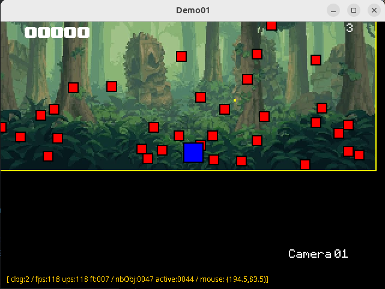
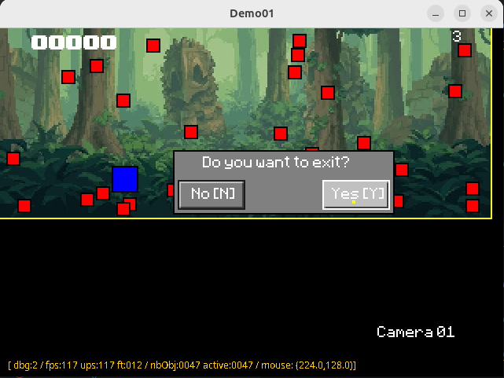

# README

[](http://nextserver01:4000/frederic/DemoAppTemplate/actions?workflow=build.yml&actor=0&status=0)

## Context

This is the readme file for Demo01Frame (1.0.0) proposing a simple 2D game framework
to implements and test your own !

## Build

To build the project, just execute the following command line :

```bash
$> build.sh a
```

## Run

To execute the build project, just run it with :

```bash
$> build.sh r
```

or you can execute the command line :

```bash
$> java -jar target/Demo01-1.0.0.jar
```



_figure 1 - This is the default result for a DemoAppTemplate execution_

>_**NOTE**_<br/>_On this figure 1, a screenshot, you can note the yellow border indicating that the debug level is set to 1 at least. the bottom orage line display some live debugging information._

Now, the following keys act as :

| key                          | Description                                   |
|------------------------------|-----------------------------------------------|
| <kbd>ESCAPE</kbd>            | Exit the <code>Demo01Frame</code> application | 
| <kbd>CTRL</kbd>+<kbd>Z</kbd> | Reset the current Scene                       | 
| <kbd>CTRL</kbd>+<kbd>G</kbd> | Reverse the current Scene Gravity             | 
| <kbd>UP</kbd>                | Move player up                                | 
| <kbd>DOWN</kbd>              | Move player down                              | 
| <kbd>LEFT</kbd>              | Move player left                              | 
| <kbd>RIGHT</kbd>             | Move player right                             | 
| <kbd>PAGE_UP</kbd>           | Add 1à new enemies                            | 



_figure 2 - Requesting to quit by pressing ESCAPE key_

### Configuration

You can enhance the default values for window, buffer, play area and gravity thanks to
the `config.properties` file:

| Config. key                  | Description                                                      |
|------------------------------|------------------------------------------------------------------|
| `app.exit`                   | Request game to not execute the main loop, only for test purpose |
| `app.window.title`           | defines the game window title                                    |
| `app.window.height`          | define the game window height                                    |
| `app.window.width`           | define the game window width                                     |
| `app.render.fps`             | define the rendering frame per seconds                           |
| `app.render.buffer.height`   | define the internal buffer resolution height                     |
| `app.render.buffer.width`    | define the internal buffer resolution width                      |
| `app.world.play.area.height` | define the game internal play area height                        |
| `app.world.play.area.width`  | define the game internal play area width                         |
| `app.world.gravity`          | define the world gravity applied to all Entity                   |

Enjoy !

Frédéric Delorme.

