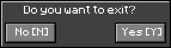
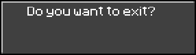
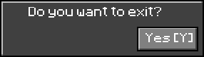

# Bring UI components

To let user interact with game, sometimes a user interface with some buttons and menu is necessary.
This chapter is dedicated to introducing interactivity with user based on the mouse usage.

We already have some `Behavior` interface, and a `KeyListener` at our `GameApp` level.
Let's extend this with `MouseXxxListener` and events interception with our extended `Behavior`: the `UIObject` API.

## Mouse events processing

We add new listeners to the GameApp class: `MouseListener`, `MouseWheelListener` and `MouseMotionListener` to get mouse
move, click, wheel and any mouse events.

first, adding new attributes to track mouse position, previous position and latest entity:

```java
public class GameApp implements KeyListener, MouseListener, MouseWheelListener, MouseMotionListener {
    //...
    private double mouseX = 0;
    private double mouseY = 0;

    private int realMouseX;
    private int realMouseY;

    private static Entity previousEntity = null;
    //...


}
```

then add the mouseMove event processing to track mouse: we will detect only `Button` instances first.

```java
public class GameApp implements KeyListener, MouseListener, MouseWheelListener, MouseMotionListener {
    //...
    // utilities to detect entity under mouse position
    private Optional<Entity> getEntityUnderMouse(double mouseX, double mouseY) {
        Optional<Entity> entityClicked = currentScene.getEntities().values().stream()
                .filter(entity -> Arrays.stream(entity.getClass().getInterfaces()).filter(i -> i.equals(UIObject.class)).findFirst().isPresent()
                        && entity.isActive()
                        && entity.contains(mouseX, mouseY)).sorted((a, b) -> Integer.compare(b.priority, a.priority)).findFirst();

        return entityClicked;
    }


    @Override
    public void mouseMoved(MouseEvent e) {
        JFrame window = renderer.getWindow();
        this.realMouseX = e.getX();
        this.realMouseY = e.getY() - window.getInsets().top;
        this.mouseX = (realMouseX * ((double) buffer.getWidth() / window.getWidth()));
        this.mouseY = (realMouseY * ((double) buffer.getHeight() / (window.getHeight() - window.getInsets().top)));

        if (getEntityUnderMouse(mouseX, mouseY).isPresent()) {
            Entity entityClicked = getEntityUnderMouse(mouseX, mouseY).get();
            //reset previously highlighted UIObject
            if (previousEntity != null && !previousEntity.equals(entityClicked)) {
                if (previousEntity instanceof Button) {
                    previousEntity.borderColor = UIObject.mouseOutBorderColor;
                    previousEntity.fillColor = UIObject.mouseOutColor;

                    debug("Mouse is out of the entity  %s (%s)", previousEntity.name, previousEntity.getClass());
                    previousEntity.setAttribute("mouse_hover", false);
                    previousEntity.behaviors
                            .forEach(b -> b.onMouseOut(this, previousEntity, mouseX, mouseY));
                }
            }
            previousEntity = entityClicked;
            if (entityClicked instanceof Button) {
                entityClicked.behaviors
                        .forEach(b -> b.onMouseIn(this, entityClicked, mouseX, mouseY));
                entityClicked.setAttribute("mouse_hover", true);
            }
            debug("Mouse enter over the entity  %s (%s)", entityClicked.name, entityClicked.getClass());

        }
    }
}
```

And now, we can process mouse button events like _clicked_, _Pressed_ and _Released_ though the `Behavior` interface and
the `UIObject` interface :

```java
public class GameApp implements KeyListener, MouseListener, MouseWheelListener, MouseMotionListener {
    //...

    @Override
    public void mousePressed(MouseEvent e) {
        if (getEntityUnderMouse(mouseX, mouseY).isPresent()) {
            Entity entityClicked = getEntityUnderMouse(mouseX, mouseY).get();
            debug("Entity %s has been pressed", entityClicked.name);
            entityClicked.behaviors
                    .forEach(b -> b.onMousePressed(this, entityClicked, mouseX, mouseY, e.getButton()));
        }
    }

    @Override
    public void mouseReleased(MouseEvent e) {
        if (getEntityUnderMouse(mouseX, mouseY).isPresent()) {
            Entity entityClicked = getEntityUnderMouse(mouseX, mouseY).get();
            debug("Entity %s has been released", entityClicked.name);
            entityClicked.behaviors
                    .forEach(b -> b.onMouseReleased(this, entityClicked, mouseX, mouseY, e.getButton()));
        }
    }

    public void mouseClicked(MouseEvent e) {
        if (getEntityUnderMouse(mouseX, mouseY).isPresent()) {
            Entity entityClicked = getEntityUnderMouse(mouseX, mouseY).get();
            debug("Entity %s has been clicked", entityClicked.name);
            entityClicked.behaviors
                    .forEach(b -> b.onMouseClick(this, entityClicked, mouseX, mouseY, e.getButton()));
        }
    }
}
```

Any component implementing this `UIObject` will be able to interact with mouse.

## UIObject

The UIObject interface will bring new mouse events processing for managing component colorization.

```java
public interface UIObject extends Behavior {

    int margin = 2;
    int padding = 2;

    Color borderColor = Color.BLACK;
    Color darkBorderColor = Color.DARK_GRAY;
    Color panelFillColor = Color.DARK_GRAY;
    Color lightBorderColor = Color.LIGHT_GRAY;
    Color midLightFillColor = Color.GRAY;
    
    Color mouseOnColor = lightBorderColor;
    Color mouseOnBorderColor = Color.WHITE;
    Color mousePressedColor = Color.CYAN;
    Color mousePressedTextColor = Color.BLUE;
    Color mouseOutColor = midLightFillColor;
    Color mouseOutBorderColor = new Color(0.1f, 0.1f, 0.1f);
    Color mouseReleasedColor = mouseOutColor;
    Color mouseReleasedTextColor = Color.WHITE;

    @Override
    default void onMousePressed(GameApp app, Entity e, double mouseX, double mouseY, int buttonId) {
        e.setFillColor(mousePressedColor);
        if (e instanceof Button || e instanceof ItemObject) {
            Button bt = (Button) e;
            bt.setTextColor(mousePressedTextColor);
        }
    }

    @Override
    default void onMouseReleased(GameApp app, Entity e, double mouseX, double mouseY, int buttonId) {
        e.setFillColor(mouseReleasedColor);
        if (e instanceof Button || e instanceof ItemObject) {
            Button bt = (Button) e;
            bt.setTextColor(mouseReleasedTextColor);
        }
    }

    @Override
    default void onMouseIn(GameApp app, Entity e, double mouseX, double mouseY) {
        e.setFillColor(mouseOnColor);
        e.setBorderColor(mouseOnBorderColor);
    }

    @Override
    default void onMouseOut(GameApp app, Entity e, double mouseX, double mouseY) {
        e.setFillColor(mouseOutColor);
        e.setBorderColor(mouseOutBorderColor);
    }
}
```

The first lines define some default colors for UI behaviors,
while the `onMouseXxx()` methods implements default behaviors to switch colors on UI display.

## let's add Dialog

The first step in a UI is to open a basic Dialog to ask question to the user requiring only a yes/no or ok/cancel
question.
This is all the purpose of our first UI, the Dialog object.

Implementing this will help us in setting all the basement of visual and behavior for all our future UI components.



This dialog is composed of the main dialog panel and two buttons.

Using the `GObject` hierarchy principle with child/prent relationship, we will add the two `Button` UI components
to the `DialogBox` panel.

### the Dialog panel

```java
public static class DialogBox extends TextObject implements UIObject {
    public DialogBox(String name) {
        super(name);
        setSize(100, 48);
        setPosition((buffer.getWidth() - this.width) * 0.5, (buffer.getHeight() - this.height) * 0.5);
        setVisible(false);
        setRelativeToCamera(true);
        setTextColor(Color.WHITE);
        add(new AlignBehavior());
    }

    public void setVisible(boolean visible) {
        setActive(visible);
        setChildVisible(visible);
    }
}
```

This `DialogBox` object inherits from the `TextObject` to get the dialog message displayed,
and implements the `UIObject` interface for UI drawing process.

> **NOTE** Each of those new objects will have their own `RendererPlugin` implementation for the rendering process.

By default, the `DialogBox` is centered on the `GameApp` window and not visible.

You have to specifically call the `setVisible()` method to show it.

#### Implementation example

```java
GameApp.DialogBox exitConfirmation = (GameApp.DialogBox) new GameApp.DialogBox("exitConfirmBox")
        .setText(app.messages.getString("app.dialog.exit.message"))
        .setFont(textFont.deriveFont(8.0f))
        .setTextColor(Color.WHITE)
        .setSize(140, 40)
        .setFillColor(Color.DARK_GRAY)
        .setBorderColor(Color.BLACK)
        .setPosition((app.getBuffer().getWidth() - 140) * 0.5, (app.getBuffer().getHeight() - 40) * 0.5)
        .setPriority(10);
```

This small piece of code produces the following output on display:



The displayed text here is the `app.dialog.exit.message` translated message (i18n).

Now let's create some buttons.

### Buttons

The button is a simple rectangle mouse sensitive that have 2 states: clicked or not.

```java
public static class Button extends TextObject implements UIObject {
    public Align align;

    public Button(String name) {
        super(name);
        setRelativeToCamera(true);
        setAlign(Align.LEFT);
    }

    public Button setAlign(Align a) {
        this.align = a;
        return this;
    }

}
```

This `Button` class extends the `TextObject` and implement the `UIObject` to support user-interface interactions.
Q new attribute is added: align defining the alignment

let's add some `Button` to our `DialogBox` :

```java
GameApp.DialogBox exitConfirmation = xxx;

GameApp.Entity okButton = (GameApp.Button) new GameApp.Button("OK")
        .setAlign(GameApp.Align.RIGHT)
        .setTextAlign(GameApp.Align.CENTER)
        .setText(app.messages.getString("app.dialog.button.ok"))
        .setTextColor(Color.WHITE)
        .setFillColor(Color.GRAY)
        .setActive(false)
        .setSize(40, 12)
        .setPriority(20);

exitConfirmation.

add(okButton);
```



we can now add the 'No' button:

```java
GameApp.Entity cancelButton = new GameApp.Button("Cancel")
        .setAlign(GameApp.Align.LEFT)
        .setText(app.messages.getString("app.dialog.button.cancel"))
        .setTextAlign(GameApp.Align.CENTER)
        .setTextColor(Color.WHITE)
        .setFillColor(Color.GRAY)
        .setActive(false)
        .setSize(40, 12)
        .setPriority(20);
exitConfirmation.

add(cancelButton);
```

To finally get a full Yes/No DialogBox:


## Adding interactions

Let's add some interaction the to buttons themselves:

1. The 'close dialog' capability to the cancel button:

```java
GameApp.Entity cancelButton = new GameApp.Button("Cancel")
        //...
        .add(new GameApp.UIObject() {
            @Override
            public void onMouseClick(GameApp app, GameApp.Entity e, double mouseX, double mouseY, int buttonId) {
                app.setExitRequest(false);
                GameApp.DialogBox db = (GameApp.DialogBox) getEntity("exitConfirmBox");
                db.setVisible(false);
                setPause(false);
                e.setFillColor(Color.CYAN);
            }
        });
```

2. the 'exit game' capabilty to the ok button:

```java
GameApp.Entity okButton = (GameApp.Button) new GameApp.Button("OK")
        //....
        .add(new GameApp.UIObject() {
            @Override
            public void onMouseClick(GameApp app, GameApp.Entity e, double mouseX, double mouseY, int buttonId) {
                app.setExitRequest(true);
                e.setFillColor(Color.CYAN);
            }
        });
```

Adding some keyboard shortcut, like displayed on the button labels itself:, but this time at DialogBox level:

| key                                  | description                                                  |
|--------------------------------------|--------------------------------------------------------------|
| <kbd>Y</kbd> or <kbd>SPACE</kbd>     | pressing the 'Y' key will act as ok button and exit the game | 
| <kbd>N</kbd> or <kbd>BACKSPACE</kbd> | pressing the 'N' key will close the dialog box               | 

```java
GameApp.DialogBox exitConfirmation = (GameApp.DialogBox) new GameApp.DialogBox("exitConfirmBox")
        //...
        .add(new GameApp.UIObject() {
            @Override
            public void onKeyReleased(GameApp app, GameApp.Entity e, KeyEvent k) {
                if (k.getKeyCode() == KeyEvent.VK_Y || k.getKeyCode() == KeyEvent.VK_SPACE) {
                    app.setExitRequest(true);
                }
                if (k.getKeyCode() == KeyEvent.VK_N || k.getKeyCode() == KeyEvent.VK_BACK_SPACE) {
                    app.setExitRequest(false);
                    app.setVisible(e, false);
                }
            }
        });
```

