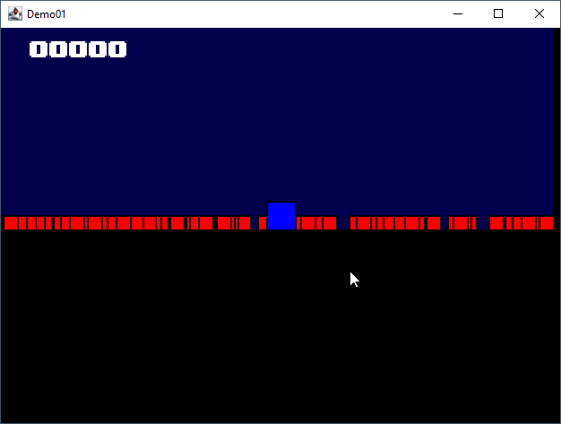

# Demo01 Frame

Welcome to the documentation for the Demo01Frame class. This class is a part of a Java-based game or simulation
framework, designed to manage and render graphical entities within a window. The Demo01Frame class serves as the main
application frame, providing the essential functionalities needed to run, display, and interact with a graphical
environment.

_figure 1 - The Demo01Frame window_

1. [Preface](01-preface.md)
2. [Application core](02-core.md)
3. [Create some entity](03-entity.md)
4. [World rules all](04-world.md)
5. [Material for physics](05-material.md)
6. [Behaviors on Entity](06-behavior.md)
7. [TextObject to show text !](07-text_object.md)
8. [Adding Camera behavior](08-camera_like.md)
